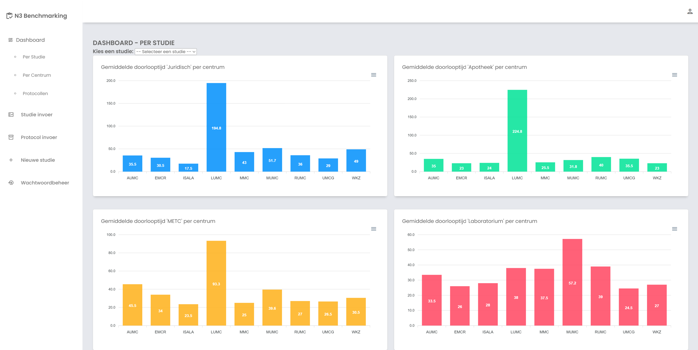
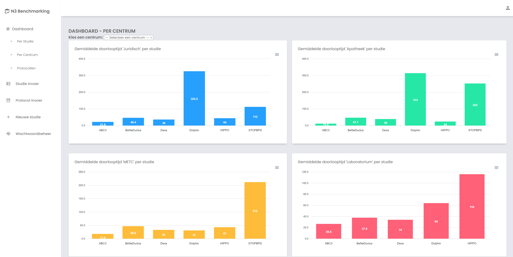
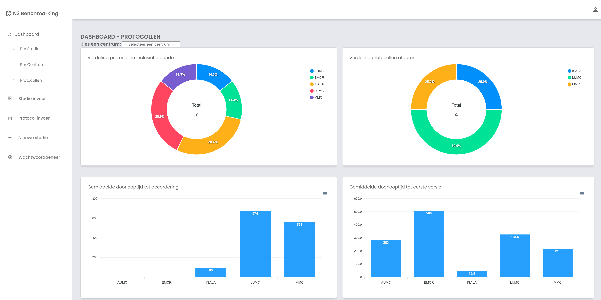
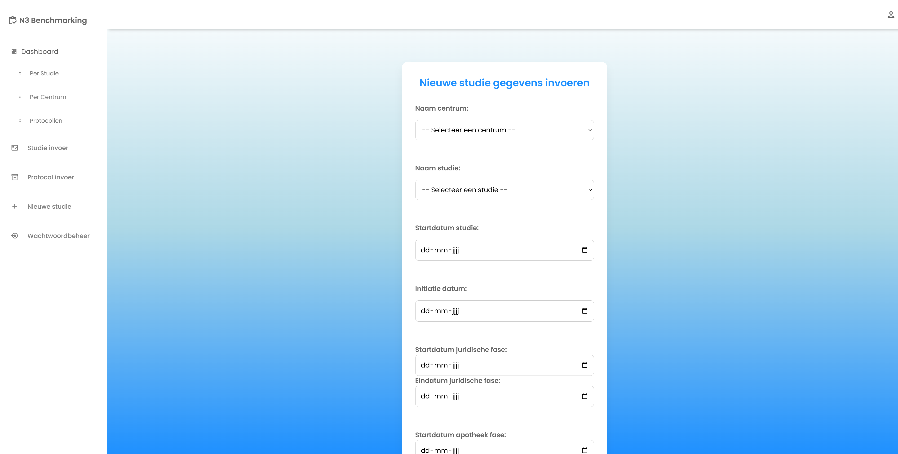
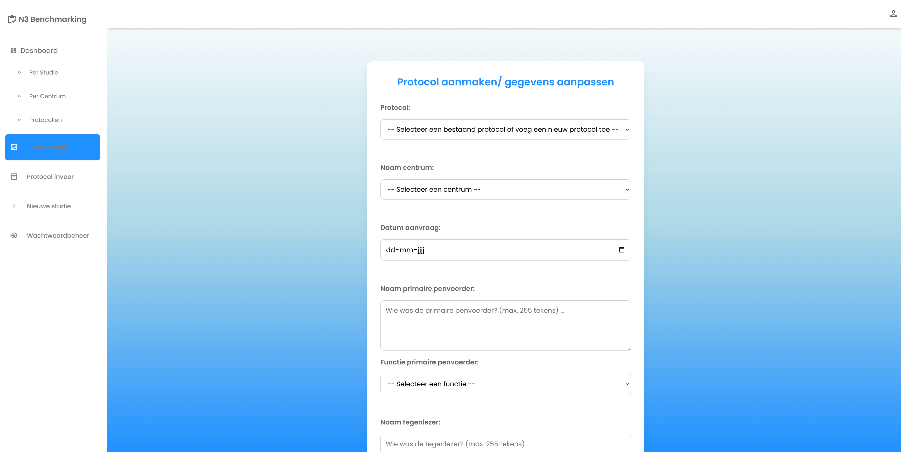
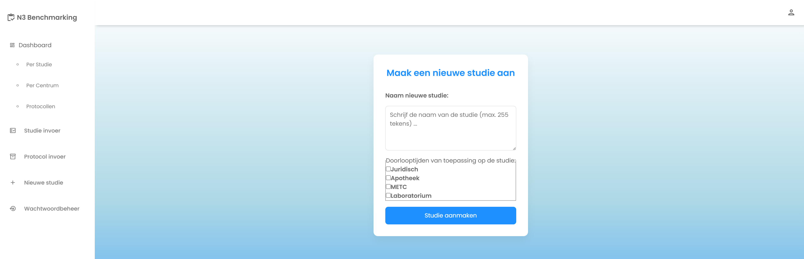
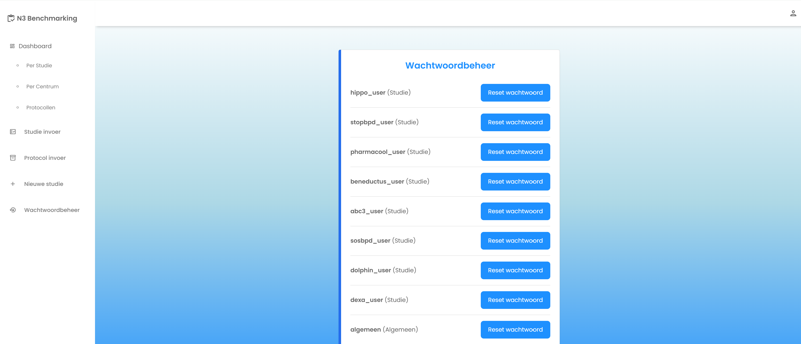

<a id="readme-top"></a>


<p align="center">
Isa Berwald, Anne Beumer, Joost Goddijn, Maggie Schepman, Irene Spijkerman
</p>


<!-- PROJECT LOGO -->
<br />
<div align="center">
  <a href="https://github.com/JostiJoost/NICU">
    
  </a>

<h3 align="center">Benchmark tool N3</h3>

  <p align="center">
    In dit project vind je een tool waarmee de N3 kan benchmarken. Dit gaat vooral over het benchmarken van studies maar ook protocollen komen aan bod. 
    Op deze manier kunnen deelnemers zien waar verbeterpunten liggen en waarin centra uitblinken waar anderen vervolgens weer van kunnen leren.
    De tool heeft als doel om van elkaar te leren om zo het studie proces te versnellen en daarmee de zorg te verbeteren.
  </p>
</div>


<!-- TABLE OF CONTENTS -->
<details>
  <summary>Table of Contents</summary>
  <ol>
    <li>
      <a href="#over-dit-project">About The Project</a>
      <ul>
        <li><a href="#gemaakt-met">Built With</a></li>
      </ul>
    </li>
    <li>
      <a href="#getting-started">Getting Started</a>
      <ul>
        <li><a href="#prerequisites">Prerequisites</a></li>
        <li><a href="#installation">Installation</a></li>
      </ul>
    </li>
    <li><a href="#usage">Usage</a></li>
    <li><a href="#roadmap">Roadmap</a></li>
    <li><a href="#contributing">Contributing</a></li>
    <li><a href="#license">License</a></li>
    <li><a href="#contact">Contact</a></li>
    <li><a href="#acknowledgments">Acknowledgments</a></li>
  </ol>
</details>


<!-- ABOUT THE PROJECT -->
## Over dit project

Dit project is tot stand gekomen in samenwerking met de Neonatale Intensive Care Unit (NICU) van het Amsterdam UMC. De NICU in Amsterdam is aangesloten bij het neonatologie netwerk (N3). Bij dit netwerk zijn naast het AUMC nog 8 andere centra aangesloten.
De wens was om een dashboard te creëren waarin metadata over studies inzichtelijk werden per centrum. Denk hierbij aan doorlooptijden en aantal inclusies. Met deze data kunnen de centra van elkaar leren om zo de algehele kwaliteit van de studies te verbeteren.
Naast studies moest er ook data over protocollen aan het dashboard worden toegevoegd. Dit om de verdeling van de protocollen binnen het netwerk beter te monitoren.

<p align="right">(<a href="#readme-top">back to top</a>)</p>


### Gemaakt met

* Java
* JavaScript
* HTML
* CSS
* IntelliJ
* ApexCharts.js
* Springboot
* SpringSecurity
* JPA

<p align="right">(<a href="#readme-top">back to top</a>)</p>


<!-- GETTING STARTED -->
## Getting Started

Deze stappen vertellen je hoe je lokaal aan de slag kan gaan met dit project.

### Prerequisites

* Van te voren moet de database worden overgezet naar een gewenste server
* Java 17 of hoger
* [IntelliJ IDEA](https://www.jetbrains.com/idea/)
* Internet verbinding om de Maven dependencies op te halen

### Installation
 
1. Clone de repository naar een lokale repository
   ```sh
   git clone https://github.com/jouw_gebruikersnaam/jouw_projectnaam.git
   ```
2. Open het project in IntelliJ
3. IntelliJ laadt automatisch de maven dependencies
4. Zorg ervoor dat 'application.properties' wordt aangepast naar jouw properties
5. Ga naar de 'main class' en start de applicatie
6. De applicatie draait standaard op 'localhost:8080'. Pas dit aan indien gewenst
7. De webapp wordt automatisch geopend.

<p align="right">(<a href="#readme-top">back to top</a>)</p>


<!-- USAGE EXAMPLES -->
## Usage

Zodra de applicatie is gestart en de webpagina is geopend kunnen gebruikers inloggen met hun account.
Hiervoor dient springsecurity goed geconfigureerd te zijn en moeten de users in de database zijn opgenomen.

- **Startscherm**
  De gebruiker komt standaard 'binnen' op het eerste dashboard. Hierop kan gefilterd worden per studie en ziet men in de grafieken de data voor alle centra.
  In de navigatie balk komt dit startscherm overeen met 'Per Studie' onder 'Dashboard'.
  
  
- **Tweede Dashboard**
  De tool biedt de gebruiker ook de mogelijkheid om juist te filteren op centra en de data in te zien voor alle studies. Hiervoor dient men op 'Per Centrum' te klikken onder 'Dashboard'.
  

- **Protocollen**
  Het derde dashboard geeft de gebruiker inzicht in de verdeling van het schrijven van de protocollen.
  

- **Invoer Studies**
  De gebruiker kan vanuit de tool rechtsreeks data aan de database toevoegen. Wanneer dit over studies gaat klikt men op 'Studie invoer'.
  

- **Invoer Protocollen**
  Ook voor invoer van protocollen kan de gebruiker terecht bij deze tool. Hiervoor dient de gebruiker op 'Protocol invoer' te klikken.
  

- **Aanmaak Nieuwe Studie**
  De gebruiker kan nieuwe studies aanmaken onder het kopje 'Nieuwe studie'. Data voor deze studie kan vervolgens worden ingevoerd bij 'Studie invoer'.
  

- **Wachtwoord Beheer**
  Bij het aanmaken van nieuwe studie wordt er automatisch een gebruikersnaam en wachtwoord gegenereerd. Wanneer gebruikers deze vergeten kan er een nieuw wachtwoord worden gegenereerd onder 'Wachtwoordbeheer'.
  


<p align="right">(<a href="#readme-top">back to top</a>)</p>


<!-- ROADMAP -->
## Roadmap

- [ ] Tab voor admin om gegevens van centra in te voeren en aan te passen
- [ ] Verwerken van de gegevens van centra in de data om te corrigeren voor grootte van centra
- [ ] Mogelijkheid voor gebruikers om zelf hun wachtwoord te wijzigen
- [ ] Meer redenen van weigering toevoegen

<p align="right">(<a href="#readme-top">back to top</a>)</p>


### Top contributors:

Programmeurs:
- Anne Beumer
- Joost Goddijn

Product Owners:
- Maggie Schepman
- Irene Spijkerman

Manager:
- Isa Berwald


<!-- CONTACT -->
## Contact

Project Link: [https://github.com/JostiJoost/NICU](https://github.com/JostiJoost/NICU)

<p align="right">(<a href="#readme-top">back to top</a>)</p>


